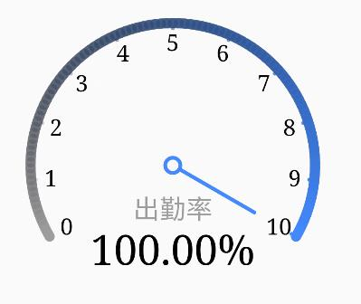
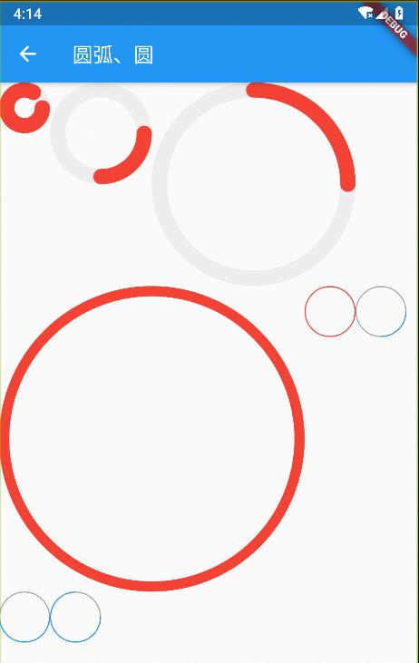
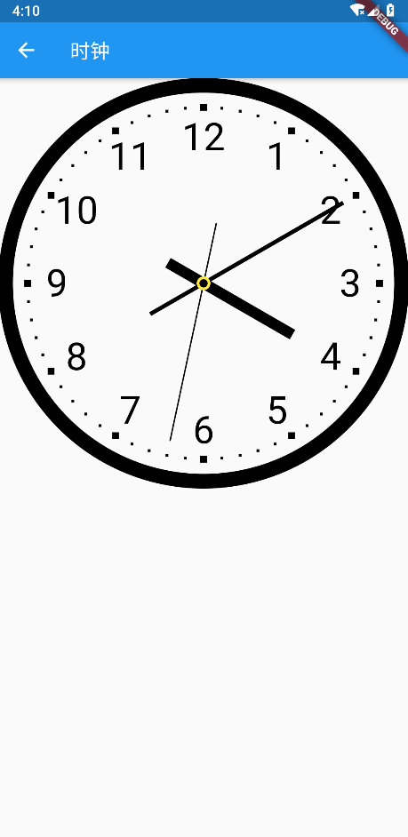
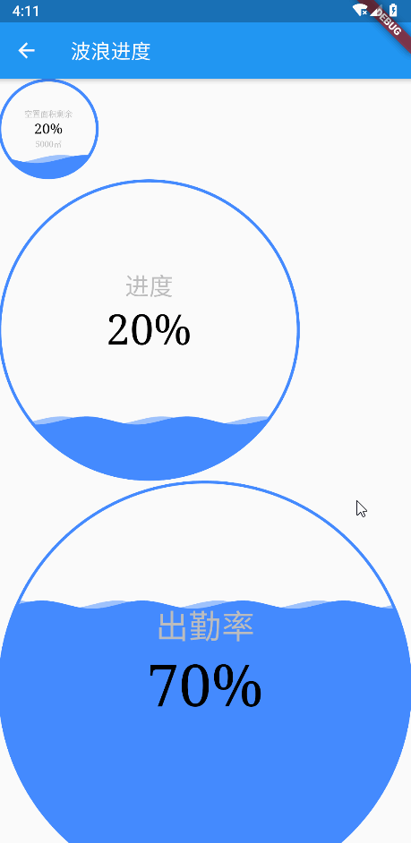
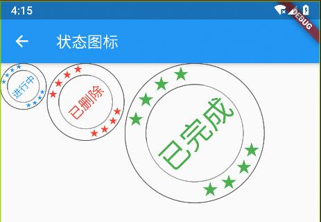

## mini_canvas

利用Canvas绘制控件。

[](https://pub.flutter-io.cn/packages/mini_canvas)  

### 导包

```dart
import 'package:mini_canvas/mini_canvas.dart';
```

### 主要实现的内容

- 五角星
  

- 仪表盘
  

- 圆弧
  

- 时钟
  

- 水波纹进度
  

- 自定义状态图
  

## 使用

### 引入库

```shell
flutter pub add mini_canvas
```

> 更多功能clone项目，运行demo

