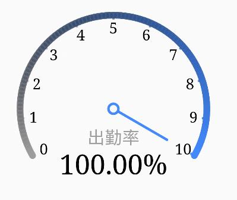
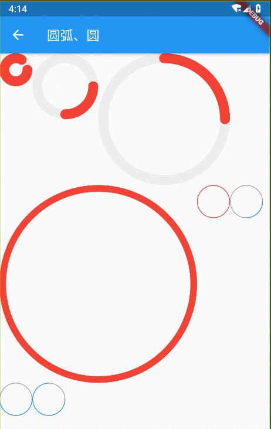
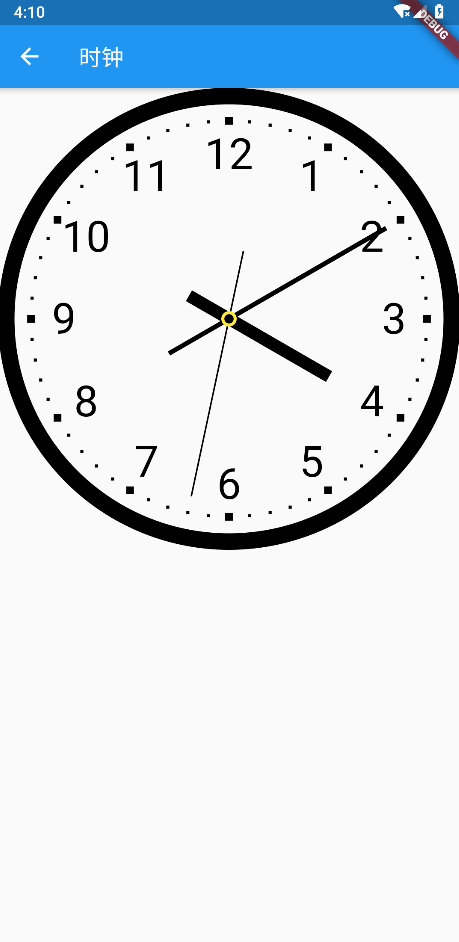
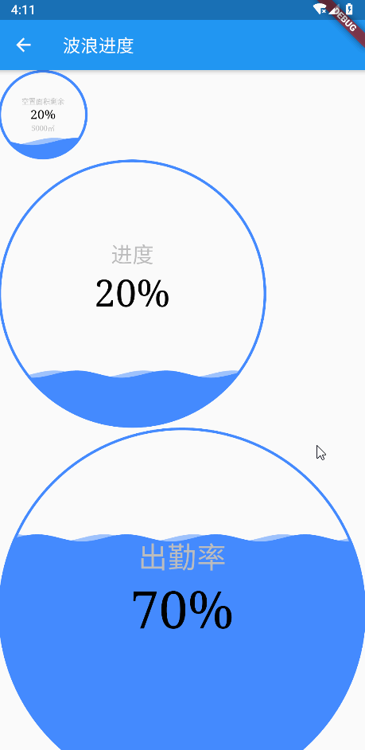
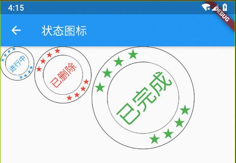

## mini_canvas

利用Canvas绘制控件。

[](https://pub.flutter-io.cn/packages/mini_canvas) 


### 导包
```dart
import 'package:mini_canvas/mini_canvas.dart';
```

### 主要实现的内容

- 五角星


- 仪表盘


- 圆弧


- 时钟


- 水波纹进度


- 自定义状态图


## 使用

### 引入库
```dart
dependencies:
  mini_canvas: ^0.1.0
```


> 更多功能clone项目，运行demo

### 开源不易，老铁们多多支持，点赞也是支持 😃 ！
|  |  |
| :---: | :---: |
